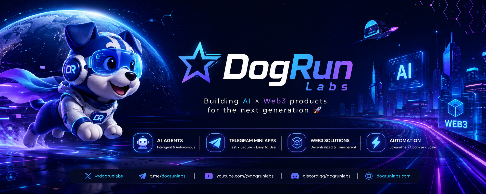

  

<h1 align="center">🐶 DogRun Labs</h1>

  <strong>Building AI × Web3 products for the next generation 🚀</strong>

  AI Agents • Automation • Smart Tools • Telegram Mini Apps • Web3

  

  

---

<h3 align="center">⚡ Tech Stack</h3>

  

  
  
  
  
  
  

---

<h3 align="center">🚀 Currently Building</h3>

🤖 AI Agents Platform &nbsp; • &nbsp;
⚡ Telegram Mini Apps &nbsp; • &nbsp;
🌐 Web3 Automation Tools

🧠 Everyday AI Utilities &nbsp; • &nbsp;
🛠 Productivity Tools &nbsp; • &nbsp;
📱 Smart Consumer Apps

🎨 AI Creator Products &nbsp; • &nbsp;
📊 AI Workflow Systems &nbsp; • &nbsp;
🚀 Experimental Tech Projects

---

<h3 align="center">🔥 Featured Projects</h3>

🚀 DogRun AI Agents &nbsp; • &nbsp;
⚡ Telegram Automation Suite &nbsp; • &nbsp;
🌐 Web3 Creator Toolkit

🧠 AI Daily Assistant &nbsp; • &nbsp;
📱 Smart Utility Apps &nbsp; • &nbsp;
🛠 Automation Dashboards

🎨 AI Content Systems &nbsp; • &nbsp;
📈 Growth & Marketing Tools &nbsp; • &nbsp;
🔮 Future AI Experiments

---

<h3 align="center">📊 GitHub Activity</h3>

  

---

<h3 align="center">🌐 Connect</h3>

  

  

  

  

---

<h3 align="center">⚡ Mission</h3>

Building futuristic AI × Web3 experiences, smart tools and automation products for creators and developers worldwide 🌍

  

